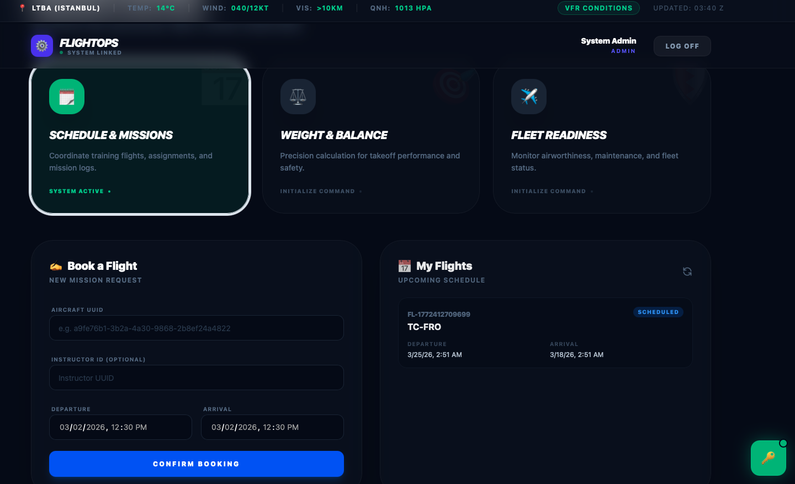
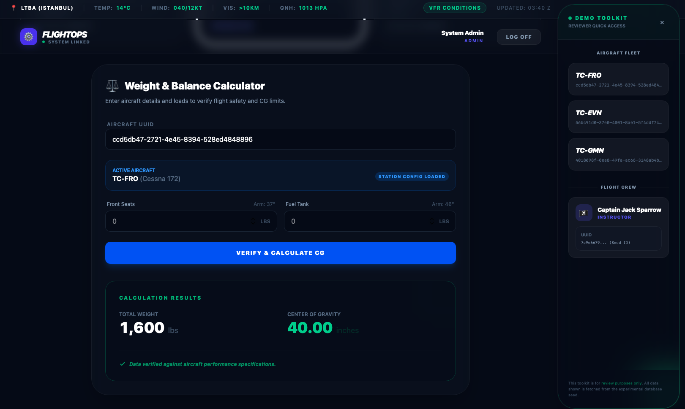

# ✈️ FlightOps: Professional Aviation Fleet & Operations Management

<table border="0">
  <tr>
    <td width="50%">
      
      <p align="center"><i>Main Operations Dashboard</i></p>
    </td>
    <td width="50%">
      
      <p align="center"><i>Dynamic W&B Calculator</i></p>
    </td>
  </tr>
</table>

<br>

FlightOps is a high-performance management system tailored for flight schools and private fleets. It bridges the gap between complex aviation logic (Weight & Balance) and seamless digital operations.

---

## 🌐 Live Demo
Experience the system live in the cloud:

* **Frontend :** https://flightoperations.netlify.app/
* **Backend :** https://flightops-backend.onrender.com

### 🔑 Demo Credentials
Use these pre-seeded credentials:
* **Email:** `admin@example.com`
* **Password:** `password123`
* *(Note: Look for the **"Demo Helper"** panel on the login screen for quick copy-pasting of UUIDs and test data.)*

---

## ✨ Core Aviation Features

### ⚖️ Precision Weight & Balance (W&B)
* **Dynamic CG Calculation:** An advanced math engine that calculates the **Center of Gravity (CG)** based on Pilot, Passenger, Fuel, and Baggage station inputs.
* **Safety Envelope Validation:** Real-time checking against aircraft-specific limits. The system automatically blocks flight submission if the CG is outside the safe flight envelope.

### 🗓️ Smart Scheduling & Conflict Detection
* **Resource Management:** Prevents double-booking of the same aircraft for overlapping time slots.
* **Airworthiness Logic:** Integrated status checks; if an aircraft is marked as **"In Maintenance"**, it is automatically excluded from the scheduling pool.

### 📊 Fleet & Crew Monitoring
* **Real-time Status:** Track your fleet's health (Ready, Grounded, or Maintenance) at a glance.
* **Pilot Logbook Integration:** Automated flight hour tracking for assigned crew members.

---

## 🛠️ Tech Stack & Architecture

| Layer | Technology | Why? |
| :--- | :--- | :--- |
| **Frontend** | React + TypeScript | Enforcing type-safety for critical aviation calculations. |
| **Styling** | Tailwind CSS 4 | Modern, responsive, and ultra-fast UI development. |
| **Backend** | Node.js + Express | Efficient, non-blocking API handling. |
| **Database** | PostgreSQL (Neon) | Relational integrity for complex flight & user schemas. |
| **ORM** | Prisma | Robust data modeling and automated migrations. |
| **Deployment** | Netlify & Render | Scalable CI/CD pipeline with cloud-native performance. |

---

## 🧠 Professional Engineering Highlights


* **Atomic Transactions:** Used Prisma transactions to ensure that flight sessions and weight records are saved together—or not at all—preventing data corruption.
* **Security First:** Implemented JWT-based authentication with secure header handling and custom CORS policies for production safety.
* **UX for Admins:** Created a dedicated "Demo Toolkit" UI to allow reviewers to navigate the system without searching through database IDs.

---

## 🚀 Local Setup (Pre-flight Inspection)

1.  **Clone the repository:**
    ```bash
    git clone [https://github.com/furkandumanoglu/flightops.git]
    ```

2.  **Backend Setup:**
    ```bash
    cd flightops-backend
    npm install
    # Set up your .env with DATABASE_URL
    npx prisma generate
    npm run dev
    ```

3.  **Frontend Setup:**
    ```bash
    cd flightops-frontend
    npm install
    # Set up VITE_API_URL in .env
    npm run dev
    ```

---
